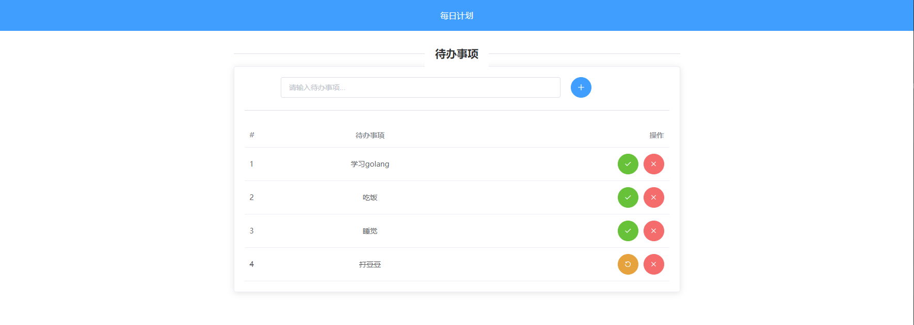

# go-bubble
一个用go语言实现的每日计划清单，演示地址：http://47.112.216.133:8080/

技术栈：

- 后端：Gin + GORM
- 前端：Vue + ElementUI

## 使用
### 下载
```bash
git clone git@github.com:tcxiaotudou/go-bubble.git
```
### 配置MySQL
1. 在你的数据库中执行以下命令，创建本项目所用的数据库：
```sql
CREATE DATABASE bubble DEFAULT CHARSET=utf8mb4;
```
2. 在`bubble/dao/mysql.go`文件中按替换数据库连接信息。
```go
[mysql]
dsn := "root:root@(192.168.1.1:3306)/bubble?charset=utf8mb4&parseTime=True&loc=Local"
```

### 安装依赖并编译
```bash
go mod tidy
go build
```

### 执行

Mac/Unix：
```bash
./bubble
```
Windows:
```bash
bubble.exe
```

启动之后，使用浏览器打开`http://127.0.0.1:8080/`即可。




